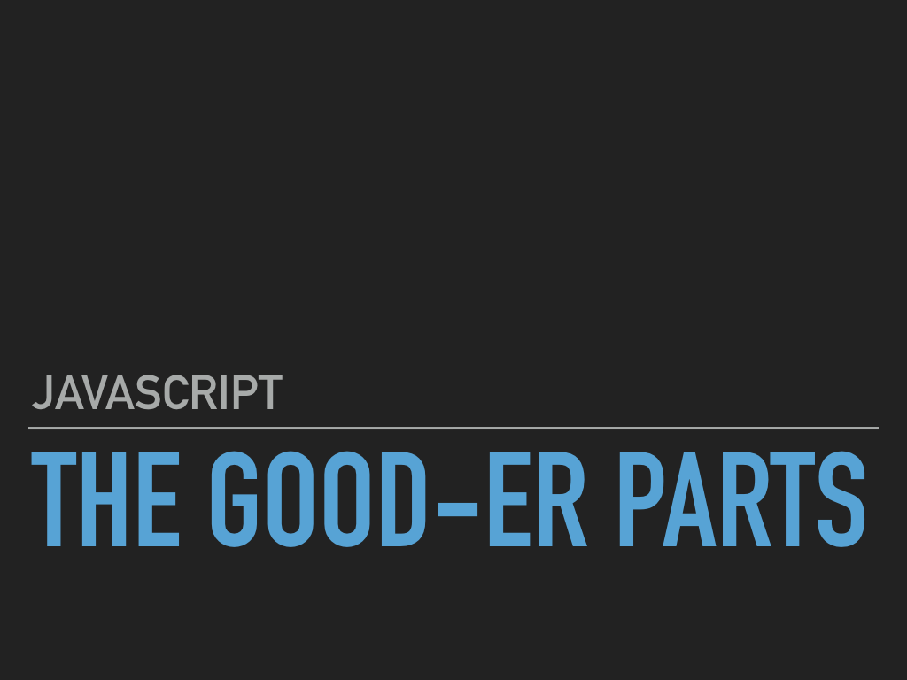

# Functional JavaScript Examples

## Slides from my talk

The `src` folder contains examples of all of the functional programming topic covered in my 2017 OpenWest Talk entitled "JavaScript: The Good-er Parts". Topics include:

## Code Examples
* [pure functions](./src/pure-functions)
* [immutability](./src/immutability)
* [expressions (vs statements)](./src/expressions)
* [function composition](./src/composition)
* [recursion](./src/recursion)
* [higher-order functions](./src/higher-order-functions)
* [currying](./src/currying)
